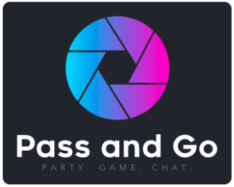

## Pass and Go
### Social video chat for all people.

* * * 

## What is Pass and Go?
* Pass and Go is a social video chat platform with integrated multiplayer game experiences designed to make interactions with others more fluid and less awkward. Pass and Go is our solution to the difficulty of social connection in a time where it’s dangerous to be around other people.

* * *

## Tech/frameworks used
<b>Built with</b>
- [Flask](https://flask.palletsprojects.com/en/1.1.x/)
- [WebRTC](https://webrtc.org/)
* * *

## Features
* Peer to peer video chat integrated with online multiplayer games
* Random or friend based matchmaking
* A dynamic reputation system to keep our platform friendly
* * *

## Try it out
Visit our live demo at: [www.pass-go.net](https://www.pass-go.net/)